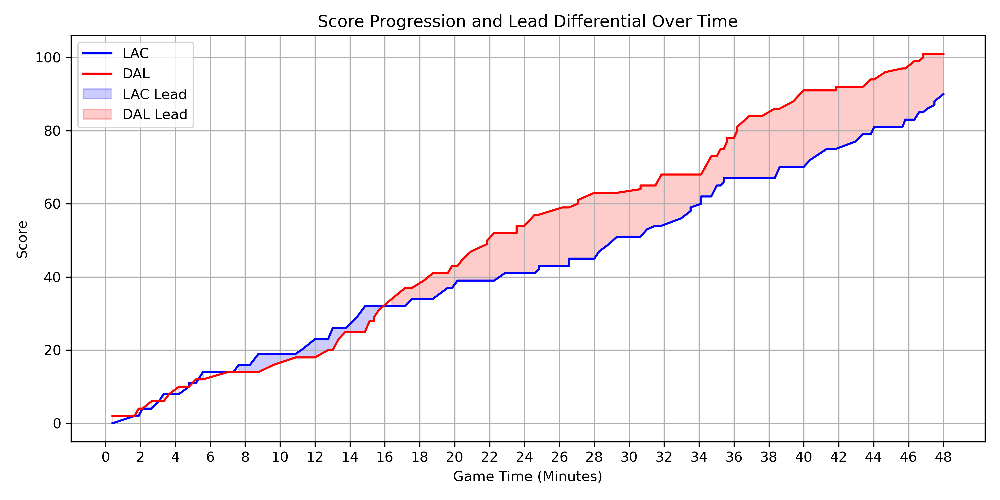
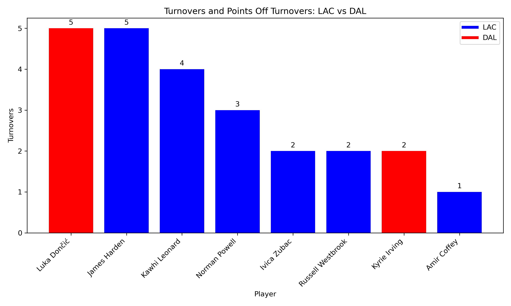
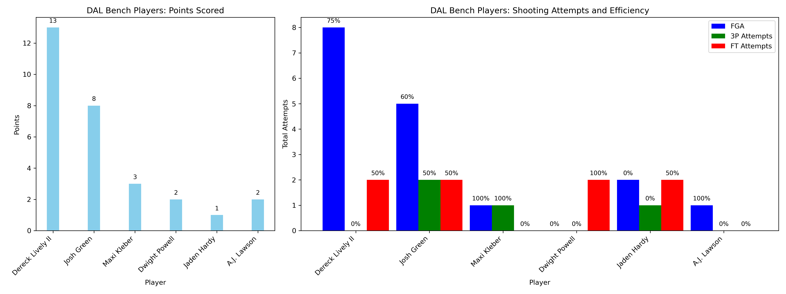
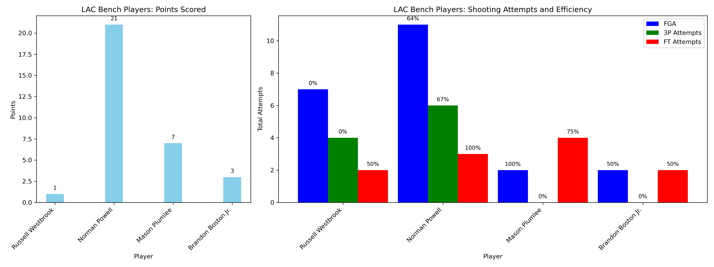
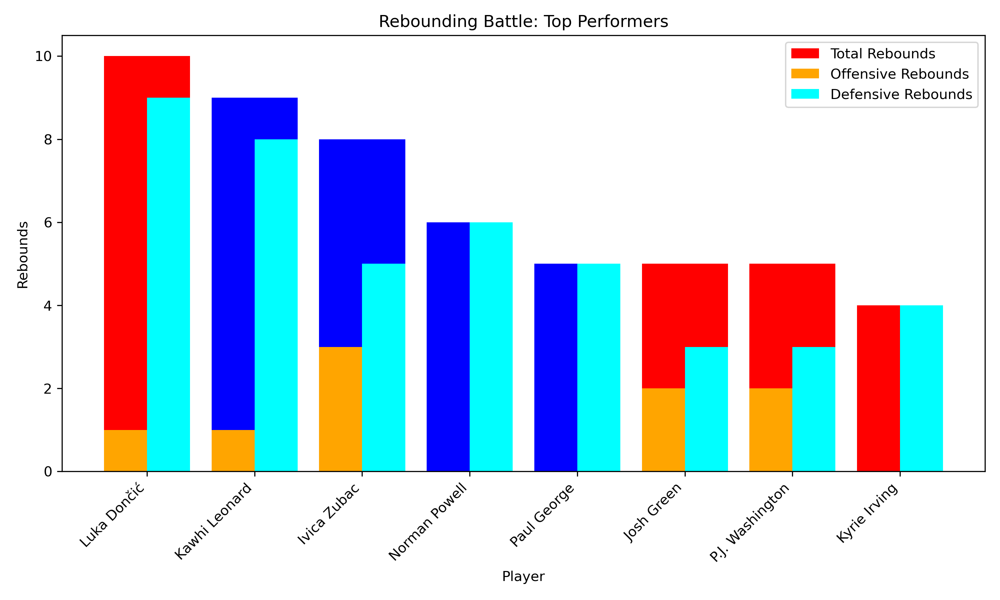

# Project Background
The focus is on game 3 of the 2024 NBA Playoffs between the Dallas Mavericks and LA Clippers. This post-match analysis leverages NBA game data to extract valuable insights into team and player performances. The analysis is conducted to enhance strategic decision-making, and targeted performance training drills for the LA Clippers.

Insights and recommendations are provided on the following key areas:

- **Momentum Shifts: Identifying key moments when control of the game changed.** 
- **Turnover Impact: Examining how turnovers influenced scoring opportunities.** 
- **Bench Contributions: Assessing the role of non-starters in the overall team performance and outcome.** 
- **Rebounding Trends: Evaluating how teams leveraged rebounds for second-chance points and defensive stops.** 

The project leverages Python for data processing, visualisation, and statistical analysis.

# Data Structure & Initial Checks

The dataset is structured based on the official NBA game logs and contains detailed match data, including:
- **Games Table: Information about matches, including date, teams, and final scores.**
- **Players Table: Player-specific details such as position, minutes played, and key performance metrics.**
- **Shots Table: Breakdown of field goals, three-pointers, and free-throw attempts by players.**
- **Advanced Stats Table: Advanced efficiency metrics including PER, true shooting percentage, and offensive rating.**

The dataset underwent initial checks for missing values, inconsistencies, and outliers to ensure data integrity.

# Executive Summary

### Overview of Findings

This analysis highlights key performance trends that shaped the game and influenced its outcome. The Mavericks gained control mid-game and effectively maintained their lead. Turnovers played a significant role in shifting momentum, with the Clippers’ mistakes leading to easy transition points for Dallas. While both teams saw contributions from their bench players, the Clippers' inconsistency diminished their overall impact. Despite winning the rebounding battle, the Clippers were unable to capitalise on second-chance opportunities.

# Insights Deep Dive
### Momentum Shifts:

* The Mavericks gained control mid-game and successfully retained a steady lead throughout the remainder of the game.
  
* Key scoring runs by the Mavericks occurred in the second and third quarters, highlighting their ability to capitalise on momentum shifts.
  
* The Clippers struggled to regain momentum after falling behind, showcasing potential issues in their in-game adjustments.

### Turnover Impact

* Clippers' turnovers translated into fast-break opportunities for the Mavericks, leading to efficient scoring chances.
  
* Live-ball turnovers were particularly costly, as they directly resulted in transition points for the opposition.
  
* The Mavericks maintained better ball control, reducing their own turnover count and preventing the Clippers from capitalising on similar opportunities.

### Bench Contributions

* The Mavericks' bench provided steady support, maintaining scoring production when starters rested.
  
* The Clippers’ bench displayed inconsistency, failing to maintain momentum in critical moments.
  
* Key bench players for the Mavericks had a noticeable impact on defensive intensity and playmaking.

### Rebounding Trends

* The Clippers won the rebounding battle but struggled to convert second-chance opportunities.
  
* Defensive rebounding by the Mavericks limited the Clippers' ability to score off missed shots.
  
* Despite rebounding advantages, the Clippers failed to generate additional offensive efficiency from it.

# Recommendations:

Based on the findings, the following recommendations are proposed for the coaching staff to consider:

* Minimise turnovers to reduce easy transition opportunities for opponents and maintain better control of momentum. **Recommended strategic guide to ensure ball safe approach, play high percentage basketball. Include training drills when possible**
  
* Enhance bench consistency by identifying rotation strategies that maximise non-starter contributions.
 **Game tape on timing of substitutions and key match ups, maximise when possible next game.**
  
* Capitalise on rebounding advantages by improving efficiency on second-chance points. **Run high risk plays once the second-chance opportunity presents itself.**
  

# Assumptions and Caveats:

Throughout the analysis, multiple assumptions were made to manage challenges with the data. See below:

* The analysis does not account for external factors such as injuries, referee decisions, or game-day conditions.
  
* Metrics are used as measures for impact but do not fully capture intangible contributions like defensive positioning, player energy, etc.